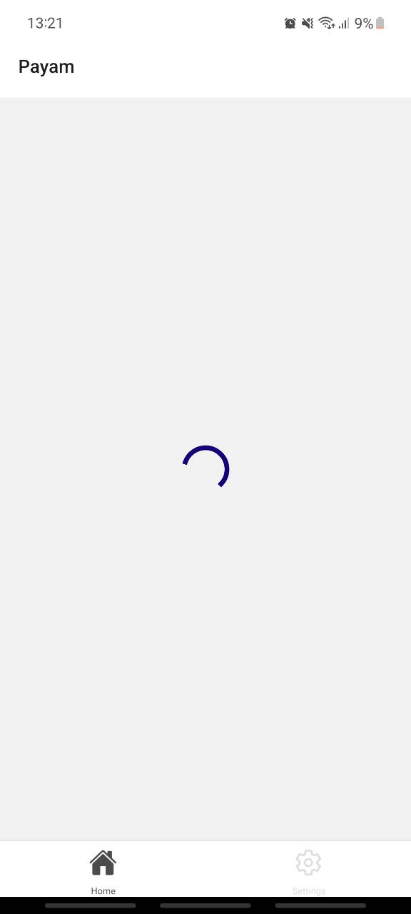
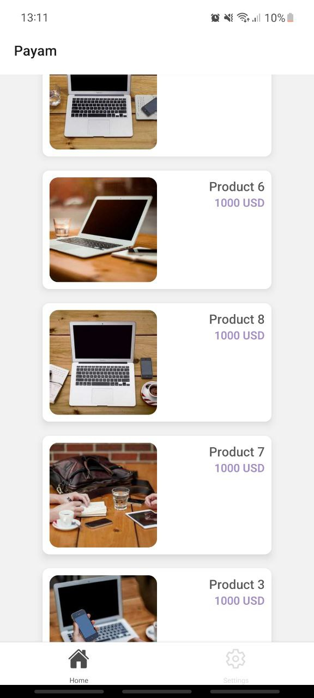

# PAYAM

## Table of Contents

- [PAYAM](#payam)
  - [Table of Contents](#table-of-contents)
  - [Introduction](#introduction)
  - [Getting Started](#getting-started)
  - [Developer Guide](#developer-guide)
    - [Backend API](#backend-api)
    - [Frontend App](#frontend-app)
  - [Build](#build)
  - [Contribution](#contribution)

## Introduction
This is a mobile application built with react native on the front and a graphql server backend with MySQL. The mobile app is a simple market app listing products fetched from the database.

| Loading Data | Products Displayed |
|--------------|--------------------|
|  |  |
## Getting Started
Requirement:
1. Node
2. Docker (for the backend)
3. Xcode and support tools (for ios development)
4. Android Studio and support tools (for android development)

Clone, download or fork the repo.

## Developer Guide
You will need to setup the frontend and backend.

### Backend API
Open the api folder
```$
cd api
```
Install dependencies. <br/>
npm:
```npm
npm install
```
yarn:
```yarn
yarn install
```
You then need to spin a container to connect mysql
```
docker-compose up
```
You then need to configure [knex](https://knexjs.org/guide/#browser) to connect to you database.
1. Obtain the ip address by running the following command in the api folder
   ```
   ifconfig -l | xargs -n1 ipconfig getifaddr
   ```
   This will produce the ip address to be added in your .env file

2. Create an .env file in your api directory following:
   ```.env
   IP_ADDRESS = <Generated IP Address>
   ```
### Frontend App
Open the client folder
```$
cd client
```
Install dependencies. <br/>
npm:
```npm
npm install
```
yarn:
```yarn
yarn install
```
Start the server:
```npm
npm run start
```
Create an .env file in your client directory following:
```.env
EXPO_PUBLIC_GRAPHQL_URI=http://000.000.000.000:4000
```
If you are developing locally, the IP address will be the same generated from the backend command:
```
   ifconfig -l | xargs -n1 ipconfig getifaddr
```

If you have a production server, the environment variable EXPO_PUBLIC_GRAPHQL_URI will be the graphql server link.

Congratulations, you can start your development journey!

## Build
For the backend, you will need to host the server with a provider. For the frontend mobile app, Check out the [EAS Guide](https://docs.expo.dev/build/introduction/).

## Contribution
Feel free to fire an issue if any or a pull request.
Find this project helpful? Leave me a star.